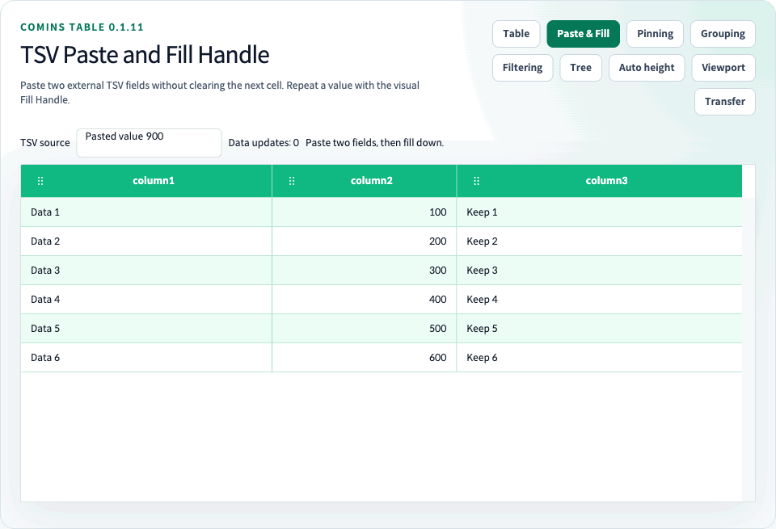

# Clipboard



<!-- comins-restriction: fill-repeat-no-series -->

[문서 홈](../README.md) · [한글 가이드](README.md) · [English](../user/09-clipboard.md) · [Playground](http://127.0.0.1:4002/examples/selection-clipboard)

Core helper와 keyboard handler는 row copy/paste, cell copy/paste, multi-cell clipboard를 제공한다. Column별 `cell.props.copyable`, `cell.props.pasteable`, `cell.props.disabled` guard로 복사/붙여넣기 가능 여부를 제한할 수 있다.

0.2.x에서 루트와 `/clipboard`는 `cell.props` guard를 사용하는 React state 계약입니다. `/core`는 `cell.copyable`·`cell.pasteable`·`cell.disabled`를 직접 사용하는 중립 state 계약입니다. [0.2.0 마이그레이션](26-migration-0.2.0.md)을 참고하고 두 계약을 혼용하지 않습니다.
`fillCominsCellRange`는 단일 값 또는 사각형 패턴을 반복하는 Core helper이며, 0.1.11부터 Visual Fill Handle UI도 옵션으로 제공합니다.

<!-- comins-doc-example: fragment -->
```ts
import {
  copyCominsCell,
  copyCominsCellRange,
  copyCominsRow,
  fillCominsCellRange,
  pasteCominsCell,
  pasteCominsCellRange,
  pasteCominsRow,
} from "comins-table";

const columns = [
  { field: "name", label: "Name" },
  { field: "locked", label: "Locked", cell: { props: { copyable: false, pasteable: false } } },
];

const copiedRow = copyCominsRow(state, "a");
const nextState = pasteCominsRow(state, copiedRow, { mode: "insert-after", targetRowId: "b" });

const copiedCell = copyCominsCell(nextState, { columnId: "name", rowId: "a" });
const changed = pasteCominsCell(nextState, { columnId: "name", rowId: "b" }, copiedCell);

const copiedRange = copyCominsCellRange(changed);
const pastedRange = pasteCominsCellRange(changed, { columnId: "name", rowId: "b" }, copiedRange);
const filled = fillCominsCellRange(pastedRange, {
  source: { columnId: "name", rowId: "a" },
  target: {
    anchor: { columnId: "name", rowId: "b" },
    focus: { columnId: "name", rowId: "c" },
  },
});
```

Range paste는 현재 table boundary 안에서만 적용한다.

React에서는 `data={rows}`와 `onChangeData={setRows}`를 함께 전달하면 Ctrl/Cmd+C, Ctrl/Cmd+V 결과가 controlled state에 반영된다. 보호해야 하는 Column은 `cell.props.copyable`과 `cell.props.pasteable`을 `false`로 설정한다.

[`/examples/selection-clipboard`](http://127.0.0.1:4002/examples/selection-clipboard)에서 `cellSelection`, `onChangeSelection`, protected Column을 함께 확인할 수 있다.

Cell을 클릭해 포커스를 둔 뒤 Ctrl/Cmd+C로 복사하고, 대상 Cell을 클릭한 뒤 Ctrl/Cmd+V로 붙여넣는다. `cellSelection`으로 범위를 드래그하면 시작 Cell에 키보드 포커스가 유지되므로 선택 범위를 바로 복사할 수 있다. `cell.renderer` 내부 입력 요소나 버튼을 클릭하면 해당 요소의 기본 포커스를 유지한다. 기본 키보드 흐름은 내부 복사 버퍼를 사용한다. `clipboard`를 활성화하면 선택 정책에 따라 OS Clipboard에도 복사한다.

## 선택 복사와 OS 클립보드

`CominsTable`의 `clipboard`를 활성화하면 브라우저의 native copy 이벤트를 처리합니다. 기본값은 기존 내부 버퍼 흐름을 유지하는 `false`입니다. 활성화 시 키보드 복사와 `ref.current.copySelection()`은 여러 Cell → 선택 Row → 단일 Cell 순서를 동일하게 사용합니다. Row 5개와 Cell 3개를 선택하면 Cell 3개를 복사하며 Row 5개 선택은 유지됩니다. Row 5개와 Cell 1개라면 Row를 복사합니다.

`copySelection(target?: CominsCopyTarget)`은 `"auto"`, `"cells"`, `"rows"`를 받습니다. 사용자 조작에 따른 버튼이나 Context Menu에서 호출하고 클립보드 접근 거부를 처리합니다. 이 Ref 메서드는 `clipboard` prop이 false여도 OS 클립보드에 기록하며, prop은 키보드 복사 활성화 여부를 제어합니다. 복사된 문자열을 `Promise<string | null>`로 반환합니다. 복사 가능한 선택이 없으면 `null`, 브라우저 클립보드 접근이 불가능하거나 거부되면 Promise rejection이 발생합니다. 키보드 복사는 native `copy` 이벤트를 사용하며 입력 요소의 텍스트 복사는 유지합니다.

| 대상 | 복사 데이터 |
| --- | --- |
| `"auto"` 또는 생략 | 여러 선택 Cell → 선택 Row → 단일 선택 Cell |
| `"cells"` | Row 선택과 무관하게 선택한 Cell 집합 또는 사각형 |
| `"rows"` | Cell 선택과 무관하게 선택한 Row의 표시 Column |

`cellSelection` 사용 시 일반 클릭, Shift+클릭, 범위 드래그는 Cell에 포커스를 두고 페이지 텍스트 선택을 정리하므로 Ctrl/Cmd+C로 Table 선택을 바로 복사할 수 있습니다. 복사는 내부 붙여넣기 버퍼도 최신 복사값으로 갱신합니다. 선택한 Cell 집합이나 범위 안에서 우클릭하면 선택을 유지하여 Context Menu에서 복사할 수 있습니다. 선택 조회 API는 복사와 독립적이며 [Selection](10-selection.md)을 참고합니다.

TSV의 탭·줄바꿈은 인용 처리하고 문자열 수식 접두어는 스프레드시트 붙여넣기를 위해 escape합니다. 숫자와 내부 붙여넣기 값은 원본을 유지합니다. `copyable: false` 또는 disabled Cell은 빈 위치로 처리합니다. 비연속 Cell은 선택 전체를 감싸는 최소 사각형으로 복사하고 미선택 위치는 비웁니다. 내부 붙여넣기는 이 빈 위치를 건너뜁니다. 복사 순서는 표시 Column과 투영된 Row 순서이며 숨겨지거나 접힌 Row는 제외합니다. 조회 API는 로딩된 선택 business Row를 반환합니다.

Viewport 복사는 미로딩 Row를 요청하지 않습니다. Cell 사각형이 미로딩 구간을 가로지르면 복사를 거절하고, Row 복사는 로딩된 선택 Row만 사용합니다. `CominsSelectionCopy`는 결정된 복사 대상·문자열·내부 행렬의 타입입니다. `clipboardPaste`가 없으면 Ctrl/Cmd+V는 Table 내부 버퍼를 계속 사용합니다.

## 외부 붙여넣기 (0.1.11)

`clipboardPaste`로 native `paste` 이벤트를 활성화합니다. 기본값은 `false`이며 `clipboard`와 독립적입니다. OS 복사와 붙여넣기를 함께 사용하려면 두 옵션을 활성화합니다. `cellSelection`과 `onChangeData`가 필요하며 로딩 중이거나 읽기 전용인 Table에는 적용하지 않습니다. Input, textarea, select, contenteditable Renderer의 기본 편집 동작은 유지합니다. 비동기 클립보드 읽기나 읽기 권한 요청은 수행하지 않습니다.

`text/plain` TSV만 읽습니다. `parseCominsClipboardText(text)`는 문자열 행렬을 반환하며 탭, CRLF/줄바꿈, 인용된 구분자, 이중 따옴표, 빈 Cell을 처리합니다. 마지막 줄 구분자는 추가 Row로 만들지 않습니다. HTML과 수식은 일반 문자열로 취급하며 실행하지 않습니다. OS 복사에서 수식 보호를 위해 붙인 작은따옴표는 다시 붙여넣어도 유지됩니다. OS 텍스트만으로는 원본 타입이나 비연속 선택의 빈 위치와 의도적인 빈 문자열을 구분할 수 없습니다.

선택 사각형의 좌측 상단 또는 포커스된 Cell부터 시작합니다. 현재 페이지 안에서 표시 Column과 정렬·필터·펼침 결과의 business Row 순서를 따릅니다. 숨겨진 Column과 Group/Detail 헤딩은 대상에서 제외합니다. 데이터 경계 밖은 잘라내며 길이가 짧은 행의 누락 위치는 유지합니다. Disabled Row/Cell과 `pasteable: false`는 건너뛰되 다음 값의 위치를 당기지 않습니다. ID와 계산 Column은 명시적으로 보호하십시오.

기본값은 문자열입니다. `column.cell.parseClipboard({ text, value, row, column, selection })`에서 원래 대상 Row를 기준으로 숫자 등의 타입으로 변환합니다. 변환 함수나 guard가 예외를 발생시키면 전체 변경을 취소합니다. `onClipboardError(error)`로 잘못된 TSV, 크기 제한, 미로딩 Viewport 범위, 변환/guard 실패를 전달하며 오류 표시는 애플리케이션이 담당합니다. 입력은 UTF-16 기준 1,000,000자, 파싱 결과 100,000 Cell까지 허용합니다. 붙여넣기 전체 사각형도 100,000 Cell 이하여야 합니다.

<!-- comins-doc-example: fragment -->
```tsx
const columns: CominsTableColumn<Row>[] = [
  { field: "id", label: "id", cell: { props: { pasteable: false } } },
  { field: "amount", label: "amount", cell: {
    parseClipboard: ({ text }) => {
      if (!text.trim() || !Number.isFinite(Number(text))) throw new Error("Invalid amount");
      return Number(text);
    },
    validateFill: ({ value }) => {
      if (typeof value !== "number" || !Number.isFinite(value)) throw new Error("Invalid amount");
    },
  } },
];
<CominsTable columns={columns} data={rows} getRowId={row => row.id}
  onChangeData={setRows} clipboard clipboardPaste fillHandle
  onClipboardError={error => setError(error.message)} />;
```

`pasteCominsText(state, target, text, rowIds?)`는 같은 불변 파싱·guard·일괄 변경 경로를 root, `/core`, `/clipboard`에서 제공합니다. Core 기본 순서는 데이터 순서이므로 정렬/필터 뷰에서는 투영된 Row ID를 전달합니다. React는 투영과 disabled Row guard를 연결합니다. 사용자 조작 한 번당 `onChangeData`는 최대 한 번 발생하며, 실제 값이 같거나 거절된 경우 발생하지 않습니다.

## Fill Handle (0.1.11)

`fillHandle`의 기본값은 `false`입니다. `cellSelection`, `onChangeData`와 함께 사용하면 선택 Cell 또는 사각형 모서리에 24px 조작 영역과 8px accent 표시가 나타납니다. 비연속 Cell 집합에는 표시하지 않습니다. 원본 사각형 밖으로 드래그하면 한 축으로 확장되며, 2차원 원본 패턴도 원래 위치에 맞추어 반복됩니다. 원본 타입을 유지하고 `parseClipboard`는 거치지 않습니다. 원본 `copyable`과 대상 `pasteable`/disabled guard를 적용합니다.

선택형 `cell.validateFill({ value, row, column, selection })`로 반영 전 대상 값을 검증할 수 있습니다. `value`는 타입을 유지한 후보 값(`unknown`)이며, `row`는 변경 전 대상 Row입니다. 동기 콜백에서 `true` 또는 `undefined`를 반환하면 허용하고, `false` 반환 또는 예외 발생 시 해당 Fill 전체를 취소합니다. 거절 시 데이터와 `onChangeData`는 변경·호출되지 않고 `fillSelection()`은 `false`를 반환하며 React의 `onClipboardError`로 오류를 전달합니다. Core `fillCominsCellRange`는 오류를 던집니다. 보호되거나 값이 동일한 대상은 검증하지 않습니다. 훅을 생략하면 기존 원본 값 반복을 유지합니다. 검증 콜백은 전달받은 데이터를 직접 변경하지 않아야 하며 비동기 검증은 지원하지 않습니다. Viewport에서는 절대 Row 인덱스를 전달합니다.

드래그 중에는 미리보기만 표시하고 수직·수평 가장자리 자동 스크롤을 지원하며 놓을 때 한 번 반영합니다. Escape, pointer 취소, 창 포커스 이탈, 원본 모델·선택·순서 변경, 원본 안으로 복귀 시에는 변경을 취소합니다. 범위를 줄여도 원본 Cell을 지우지 않습니다. 숫자/날짜 자동 연속값 생성과 축소 시 삭제는 지원하지 않습니다. 전체 채우기 사각형은 100,000 Cell로 제한하며 UI는 이를 초과한 대상을 미리보기하지 않습니다.

핸들을 클릭하면 **Fill down / Fill right** 버튼이 나타납니다. 애플리케이션 버튼에서 `ref.current.fillSelection("down" | "right")`도 호출할 수 있습니다. 아래로 채우기는 선택의 첫 Row를 나머지 선택 Row에, 오른쪽으로 채우기는 첫 Column을 나머지 선택 Column에 반복합니다. Ref는 실제 데이터가 변경되었을 때만 `true`를 반환합니다. 메뉴는 기본 키보드 버튼 조작과 Escape 포커스 복귀를 제공하므로 드래그 없이도 사용할 수 있습니다.

`fillCominsCellRange(state, { source, target }, rowIds?)`의 `source`는 기존 Cell 주소 또는 사각형을 받습니다. 자동 높이, pinning, 가상화, Tree business Row, 펼쳐진 Group leaf에도 같은 변경 경로를 적용합니다. Viewport 대상은 연속하여 로딩된 범위여야 하며 미로딩 데이터를 요청하거나 캐시 공백을 건너뛰지 않습니다. Parser에는 절대 Viewport 인덱스를 전달합니다. 드래그 중 캐시/모델 교체는 취소 처리하며 영속 저장과 재조회는 애플리케이션이 담당합니다.

[Paste & Fill Handle Playground](http://127.0.0.1:4002/examples/fill-handle)
