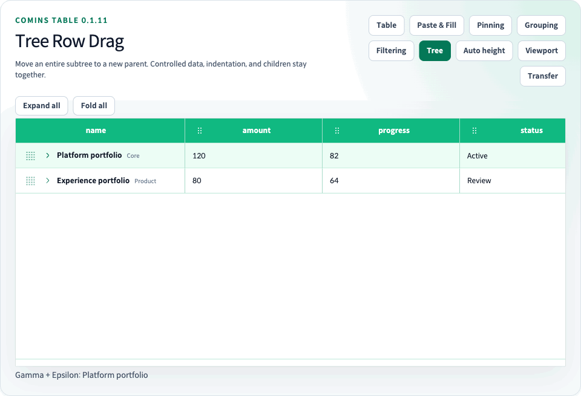

# Tree Grid



<!-- comins-restriction: tree-no-pagination -->

[문서 홈](../README.md) · [한글 가이드](README.md) · [English](../user/17-tree-grid.md) · [Playground](http://127.0.0.1:4002/examples/tree-grid)

Tree Grid는 기존 컬럼 모델을 유지하면서 제어형 중첩 Row를 출력한다. 실제 업무 Row는 `item`에 넣으며, `{ field: "name" }` 같은 기존 컬럼과 cell formatter는 계속 `item` 객체를 대상으로 동작한다.

<!-- comins-doc-example: fragment -->
```tsx
const tableRef = useRef<CominsTableRef<PersonRow>>(null);
const [data, setData] = useState([
  {
    item: { id: "engineering", name: "Engineering", age: 60, role: "Owner" },
    expand: false,
    children: [
      {
        item: { id: "platform", name: "Platform Team", age: 32, role: "Editor" },
      },
    ],
  },
]);

<>
  <button onClick={() => tableRef.current?.expand(["engineering"])}>펼치기</button>
  <button onClick={() => tableRef.current?.fold()}>전체 접기</button>
  <CominsTable
    ref={tableRef}
    columns={columns}
    data={data}
    defaultExpandAll={false}
    getRowId={(item) => item.id}
    onChangeData={setData}
    summary={{ columns: { age: "sum" } }}
    tree
    virtualized
  />
</>;
```

## 제어형 data 계약

- `data`는 `{ item, expand?, children? }` node 배열이다.
- `item`은 column, formatter, renderer, row callback, `getRowId`가 받는 업무 Row다.
- `defaultExpandAll`은 명시적 `expand` 값이 없는 node의 초기 fallback을 설정하며 기본값은 `true`다. node의 명시적 `expand`가 우선한다. mount 후 `defaultExpandAll` 변경은 controlled node 상태를 초기화하지 않는다.
- node의 `expand`는 해당 node의 직접 children을 visible pre-order row 목록에 포함할지 결정한다.
- `children`은 재귀적인 node 배열이다.
- `getRowId(item)`은 현재 접혀 있는 descendant를 포함한 모든 depth에서 전역적으로 유일하고 안정적인 id를 반환해야 한다.
- 펼침 버튼과 cell 수정은 호출자가 소유한 node를 변경하지 않고, 새 tree를 `onChangeData`로 전달한다.
- 처음 선언한 컬럼은 Tree 기준 컬럼이다. 이 컬럼은 맨 왼쪽에 고정되고 컬럼 이동 Handle을 표시하지 않으며, 다른 컬럼 순서가 바뀌어도 Expander를 계속 소유한다.

Tree 정렬은 sibling 집합별 재귀 정렬이다. 부모는 항상 자신이 보이는 descendant보다 앞에 유지된다. `multiSort`를 설정하면 Flat Table과 동일한 `Shift` Header 조작으로 전체 우선순위 정렬 모델을 모든 sibling 집합에 적용한다. Summary Row는 펼침 상태와 관계없이 leaf `item`만 집계하며, 부모 값은 중복 집계를 막기 위해 제외한다.

## Ref 펼침 제어

`CominsTableRef`는 `expand(nodeIds?)`와 `fold(nodeIds?)`를 제공한다. readonly id 배열을 전달하면 여러 branch를 한 번의 controlled `onChangeData` 호출로 변경한다. 인수를 생략하면 모든 branch를 대상으로 하며 빈 배열은 아무 작업도 하지 않는다. 중복 id, 존재하지 않는 id, leaf id는 무시한다.

<!-- comins-doc-example: fragment -->
```tsx
tableRef.current?.expand(["engineering", "platform"]);
tableRef.current?.fold(["platform"]);
tableRef.current?.expand(); // 전체 branch 펼치기
tableRef.current?.fold(); // 전체 branch 접기
```

상위 node가 접힌 상태에서는 하위 node만 펼치는 요청을 차단한다. 접힌 상위와 하위를 함께 열어야 하면 같은 `expand` 호출의 배열에 두 id를 모두 포함한다. Flat Table에서 이 method를 호출하면 안전하게 아무 작업도 하지 않는다.

## Style, Component, Renderer

Tree Grid는 현재 Row 및 Cell 계약을 그대로 사용한다. hierarchy 기반 Row 스타일은 `rowProps.className`과 `rowProps.style`로 설정한다. `checkbox`, `select`, `toggle` 같은 기존 컬럼 `cell.components` 타입은 node의 `item`을 읽고 갱신한다. `cell.renderer`는 모든 Tree Node에 커스텀 React Component를 반환할 수 있으므로 별도 Component Row API를 추가하지 않는다.

Playground는 정확히 `10000`개 node로 구성된 고정 row-height virtualized Tree를 제공한다. Virtualization은 현재 window만 렌더링하며 hierarchy flatten과 ref 펼침은 controlled Tree 전체를 대상으로 동작한다.

## Tree Grid V1 제한

Tree Grid는 고정·자동 Row 높이를 지원한다. Pagination, lazy loading, infinite scrolling, Viewport Datasource, Tree의 테이블 간 이동, Row 단위 copy/paste는 지원하지 않는다. Cell과 range clipboard 동작은 visible `item` row 범위에서 계속 사용할 수 있다.

Tree expand는 Flat Row Expand 및 Row Grouping과 다른 기능이다. Row Expand는 하나의 flat source Row 아래에 Detail 영역을 출력한다. Row Grouping은 flat Row 값을 기준으로 hierarchy를 파생하고 별도의 controlled group expansion state를 사용하며 Tree Grid prop branch와 결합할 수 없다.

`npm run dev` 실행 후 `/examples/tree-grid`에서 동작 예제를 확인할 수 있다.

Column Filtering도 flat-data projection이므로 Tree Grid prop branch와 결합할 수 없다. Tree filtering이 필요한 application은 자체 controlled nested data를 생성해야 한다.

## Tree Row 드래그

`treeRowDrag`를 생략하면 Tree 드래그를 활성화하지 않습니다. `allowReparent`의 기본값은 `false`입니다. `treeRowDrag={{}}`로 모든 깊이의 형제 순서 변경을 활성화합니다. `allowReparent: true`이면 전체 subtree를 다른 부모 아래 또는 루트로 이동할 수 있습니다. `rowProps.draggable`, `rowProps.disabled`로 개별 source를 제한합니다. `onChangeData`가 필요하며 원본 Tree와 item을 직접 변경하지 않습니다.

<!-- comins-doc-example: fragment -->
```tsx
<CominsTable
  tree
  data={nodes}
  columns={columns}
  getRowId={(item) => item.id}
  onChangeData={setNodes}
  treeRowDrag={{ allowReparent: true }}
/>
```

`CominsTreeRowDragConfig<TData>.canDrop`은 source·target·destination·before/after/inside 위치를 담은 `CominsTreeDropContext`를 받습니다. 허용 범위를 좁힐 수 있지만 순환이나 잘못된 목적지를 허용할 수는 없습니다. 접힌 descendant도 함께 이동하며 펼침 상태를 보존합니다. Leaf는 부모가 될 수 있고 마지막 자식이 나간 기존 부모는 업무 노드로 남으므로 leaf-only Summary 대상이 달라질 수 있습니다.

접힌 부모에 inside drop을 허용하되 자동으로 펼치지 않습니다. 정렬 중에는 수동 이동을 차단합니다. Handle은 pointer edge scroll과 Space 시작·방향키 목적지 선택·Enter 확정·Escape 취소를 지원합니다. 부모 변경이 허용되면 오른쪽/왼쪽 키로 하위 이동·부모 밖 이동을 선택합니다. 목적지와 결과를 안내하며 drop 표시가 Row 높이를 바꾸지 않습니다.

Tree callback 타입은 `CominsBeforeTreeRowDragPayload`, `CominsTreeRowDragPayload`, `CominsAfterTreeRowDragPayload`이며 키보드 이벤트도 포함합니다. 시작 전 false 반환은 after callback 없이 취소하고, 시작된 gesture는 한 번 종료합니다. target metadata에 `tree.parentId`, `tree.beforeRowId`, `tree.position`을 전달합니다.

`moveCominsTreeNode(nodes, rowId, destination, getRowId, { allowReparent })`는 immutable 이동 연산입니다. `CominsTreeMoveDestination`의 `parentId: null`은 루트, `beforeRowId: null`은 형제 배열 끝입니다. 변화가 없거나 유효하지 않은 이동은 원본 참조를 반환하고 중복 ID는 거부합니다. 위치가 바뀌어도 ID는 유지되어야 합니다.

Playground의 Tree 이동 예제는 부모 변경과 자동 Row 높이를 켠 상태로 시작하여 두 동작을 바로 확인할 수 있습니다. 예제 기본 설정이며 패키지 기본값을 변경하지 않습니다.

## Tree 슬롯 (0.2.1)

Tree Grid의 `treeSlots`로 첫 번째 열의 `leading`, `content`, `trailing` 영역을 변경할 수 있습니다. 들여쓰기, 펼침 버튼과 leaf 간격은 테이블이 유지합니다. `leading`은 펼침 버튼 다음에 위치하고, `trailing`은 셀 끝에 정렬됩니다. 다른 열은 기존 렌더러를 유지합니다.

사용 가능한 너비를 넘는 콘텐츠는 잘라서 오른쪽 버튼을 덮지 않도록 합니다. 왼쪽·오른쪽 컨트롤은 간결하게 구성하고 컨트롤이 들어갈 만큼 열 너비를 지정합니다.

`CominsTreeSlots<TData>` 콜백은 `CominsTreeSlotParams<TData>`를 받습니다. `item`, `rowId`, `depth`, `path`, `expanded`, `hasChildren`, `defaultContent`를 제공합니다. 노드 정보는 `CominsVisibleTreeRow`를 따릅니다. `expanded`는 leaf에서도 설정된 펼침 상태를 반영하므로, branch 여부는 `hasChildren`으로 구분합니다. `defaultContent`는 기존 셀 렌더러, 내장 컴포넌트 또는 표시 값입니다. `content`를 생략하면 기본 내용을 유지하며 `null`을 반환하면 의도적으로 숨깁니다. 애플리케이션 소유의 `item`과 `path`는 직접 변경하지 않습니다.

<!-- comins-doc-example: fragment -->
```tsx
<CominsTable
  tree
  data={nodes}
  columns={columns}
  getRowId={(item) => item.id}
  onChangeData={setNodes}
  treeSlots={{
    leading: ({ hasChildren }) => <span aria-hidden="true">{hasChildren ? "▸" : "·"}</span>,
    content: ({ defaultContent }) => <strong>{defaultContent}</strong>,
    trailing: ({ item }) => <button type="button" onClick={() => showDetails(item)}>상세</button>,
  }}
/>
```

모든 슬롯에서 이미지나 React 컴포넌트를 반환할 수 있습니다. 기본 버튼·링크·폼 입력과 연결된 라벨·편집 가능한 요소·포커스 가능한 요소와 button/checkbox/switch/menuitem 역할의 컨트롤은 클릭·포인터·문맥 메뉴·키보드·복사·붙여넣기 이벤트가 테이블의 선택·편집과 콜백으로 전달되지 않습니다. 컨트롤 자체의 기본 동작은 취소하지 않습니다. 일반 텍스트 슬롯은 기존처럼 행 선택과 테이블 복사·붙여넣기가 가능합니다. 사용자 컨트롤의 접근성 라벨, 비활성 상태와 동작은 애플리케이션이 관리하며, 동작에 맞는 의미 있는 요소를 사용합니다. 전체를 독립 컨트롤로 사용할 의도가 없다면 일반 행 텍스트를 포커스 가능한 래퍼로 감싸지 않습니다.

이 콜백은 `comins-table`에서 제공하는 React 렌더링 계약이며 `/core`에 React·DOM 타입을 추가하지 않습니다. Playground의 **Tree 노드 슬롯** 예제에서 왼쪽 이미지, 중앙 콘텐츠, 오른쪽 버튼을 사용하고 선택·버튼 실행 횟수를 확인할 수 있습니다.
