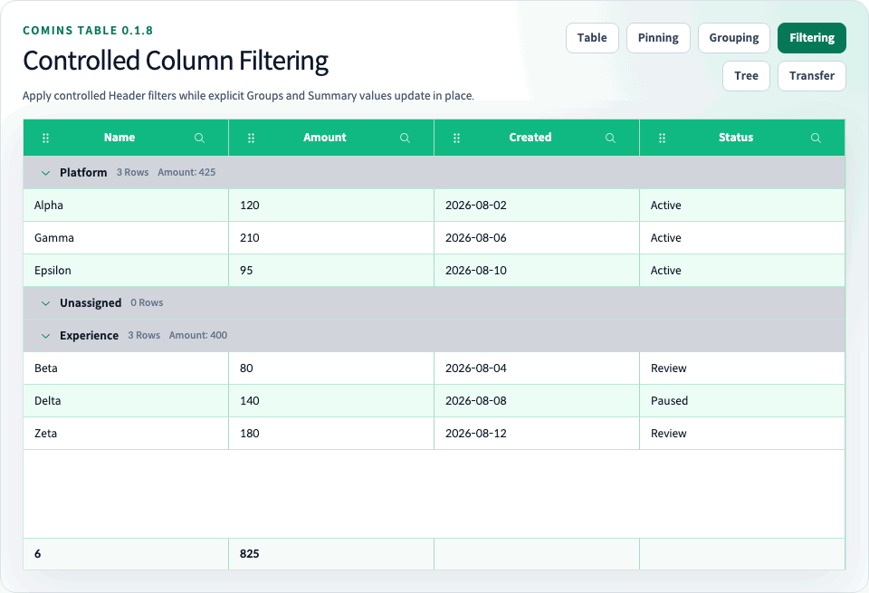

# Column Filtering

[문서 홈](../README.md) · [한글 가이드](README.md) · [English](../user/21-column-filtering.md) · [Playground](http://127.0.0.1:4002/examples/column-filtering)



Comins Table은 application-owned flat `data`를 대상으로 controlled client-side Column Filtering을 제공합니다. 각 Column은 `columns[].filter`로 값 kind를 정의하고 application은 전체 `columnFiltering.model`과 현재 열린 Header Filter popover를 모두 소유합니다.

Text, number, UTC date, boolean, Summary Row, 정렬과 Row Grouping 결합 예제는 [`/examples/column-filtering`](http://127.0.0.1:4002/examples/column-filtering)에서 확인합니다.

## Controlled 모델

```tsx
type Row = {
  active: boolean;
  amount: number;
  id: string;
  joinedAt: string;
  name: string;
};

const [model, setModel] = useState<CominsColumnFilterModel>([]);
const [openColumnId, setOpenColumnId] = useState<string | null>(null);

const columns: Array<CominsTableColumn<Row>> = [
  { field: "name", filter: { kind: "text" }, label: "Name", sort: true },
  { field: "amount", filter: { kind: "number" }, label: "Amount", sort: true },
  { field: "joinedAt", filter: { kind: "date" }, label: "Joined", sort: true },
  { field: "active", filter: { kind: "boolean" }, label: "Enabled", sort: true },
];

<CominsTable
  columnFiltering={{
    model,
    onChangeModel: setModel,
    onChangeOpenColumnId: setOpenColumnId,
    openColumnId,
  }}
  columns={columns}
  data={rows}
  getRowId={(row) => row.id}
/>
```

`CominsColumnFilteringConfig`는 application state를 내부에 저장하지 않습니다. `onChangeModel`은 한 Column 조건을 편집하거나 지운 뒤의 전체 next 배열을 전달합니다. `onChangeOpenColumnId`는 next Column ID 또는 `null`을 전달하며 이를 `openColumnId`에 반영하면 한 번에 하나의 popover가 열립니다.

`onChangeOpenColumnId`를 생략하면 Header Filter 버튼이 disabled됩니다. 외부에서 popover를 열었지만 `onChangeModel`을 생략하면 editor는 read-only입니다. Filter 버튼과 popover는 click, keyboard, pointer, 정렬, resize와 Column Move event를 격리합니다. 외부 pointer 입력과 `Escape`는 controlled callback으로 닫고 `Escape`는 trigger로 focus를 복귀시킵니다.

## Column 설정 및 operator

`CominsColumnFilterConfig<TData, TValue>`는 `CominsColumnFilterKind`를 사용하고 각 rule은 `CominsColumnFilterOperator`를 사용합니다. 다음 값을 지원합니다.

| Kind | Operators |
| --- | --- |
| `text` | `contains`, `notContains`, `startsWith`, `endsWith`, `equals`, `notEquals`, `isEmpty`, `isNotEmpty` |
| `number` | `equals`, `notEquals`, `greaterThan`, `greaterThanOrEqual`, `lessThan`, `lessThanOrEqual`, `between`, `isEmpty`, `isNotEmpty` |
| `date` | `number`와 같은 비교, 범위 및 empty operator |
| `boolean` | `equals`, `notEquals`, `isEmpty`, `isNotEmpty` |

Text 비교는 기본적으로 대소문자를 구분하지 않습니다. 정확한 대소문자 비교가 필요하면 Column Filter 설정에 `caseSensitive: true`를 지정합니다. 공백은 text 값이며 `null`, `undefined`, `""`만 empty입니다.

Number 비교는 finite numeric Row 값과 model 값만 사용합니다. `between`은 뒤집힌 양 끝 값을 inclusive 범위로 정규화합니다. Numeric이 아닌 Row 값과 `NaN`은 number rule과 일치하지 않습니다.

Date Filter는 UTC calendar day를 사용합니다. Model 값은 정확한 `YYYY-MM-DD` 문자열을 사용하며 Row 값은 UTC day로 정규화 가능한 valid Date, timestamp 또는 date string일 수 있습니다. Invalid calendar date는 강제 변환하지 않고 무시합니다.

일반 nested `field` 값과 비교 값이 다르면 `filter.getValue`를 사용합니다.

```tsx
{
  field: "owner",
  label: "Owner",
  filter: {
    kind: "text",
    getValue: ({ row }) => row.owner?.displayName,
  },
}
```

## 정규화

`CominsColumnFilterRule`은 `columnId`, `operator`, optional `value`, optional `valueTo`를 포함합니다. 서로 다른 Column rule은 AND로 결합합니다. 한 Column에 valid rule이 중복되면 첫 valid rule을 사용합니다.

Unknown Column, `filter`가 없는 Column, kind와 호환되지 않는 operator, invalid value와 malformed untyped entry는 무시합니다. Valid rule이 없으면 모든 source Row가 표시됩니다. 원본 `data` 배열과 business Row identity는 변경하지 않습니다.

## Projection, 정렬 및 Summary

Client-side projection 순서는 다음과 같습니다.

1. Source Row index를 Filter합니다.
2. 설정된 경우 Row Group membership을 구성합니다.
3. 기존 Row 정렬 정책을 적용합니다.
4. Flat pagination 또는 virtualization을 적용합니다.
5. Leaf Row와 fixed-height Detail을 렌더링합니다.

Summary Row 집계는 flat pagination 전에 filtered leaf Row를 사용합니다. Header 정렬은 Filter model을 변경하거나 재배치하지 않습니다. Flat `pageIndex`가 Filter 결과 범위를 벗어나면 마지막 page로 clamp합니다.

Filter로 숨겨진 selected Row ID와 expanded Row Detail ID는 dormant 상태를 유지하고 Filter 변경 후 다시 나타날 수 있습니다. Hidden Cell 또는 range selection은 visible projection이 필요한 address이므로 clear합니다.

## Row Grouping 결합

`columnFiltering`은 controlled 단일 Depth `rowGrouping`과 결합할 수 있습니다. Filtering은 Group membership 입력만 변경합니다.

- Filter 결과 member가 0개인 Group을 포함해 모든 explicit Group을 유지합니다.
- Application-owned `groups` 배열이 Group 위치와 순서 source of truth로 유지됩니다.
- Group count와 built-in aggregate는 filtered member를 사용합니다.
- 기존 Header 정렬은 각 Group 내부에서 독립 실행되고 Group Row를 재배치하지 않습니다.
- Controlled Group expansion ID는 유지됩니다.
- Group Drag는 filtered Row projection이 아닌 explicit Group model만 변경하므로 유지할 수 있습니다.

## 경계

Column Filtering은 CSR flat-data 기능입니다. Tree Grid, Infinite Scroll, Lazy Load, `loadingMore` 또는 Row Drag와 결합할 수 없습니다. Model이 비어 있어도 `columnFiltering` 설정이 존재하면 Row Drag를 비활성화합니다. 잠재적으로 일부만 보이는 projection에서 Row 이동 의미가 모호하기 때문입니다. Grouped Filtering은 Row Grouping의 pagination 금지 조건도 그대로 적용합니다.

Server-side filtering, custom Filter editor renderer, OR group, Column별 multi-rule 평가, locale-aware text collation, fuzzy search, relative date, Tree filtering과 remote datasource filtering은 이번 release 범위 밖입니다. 필요한 경우 application이 자체 정책으로 controlled `data`를 만든 뒤 Comins Table에 전달할 수 있습니다.
