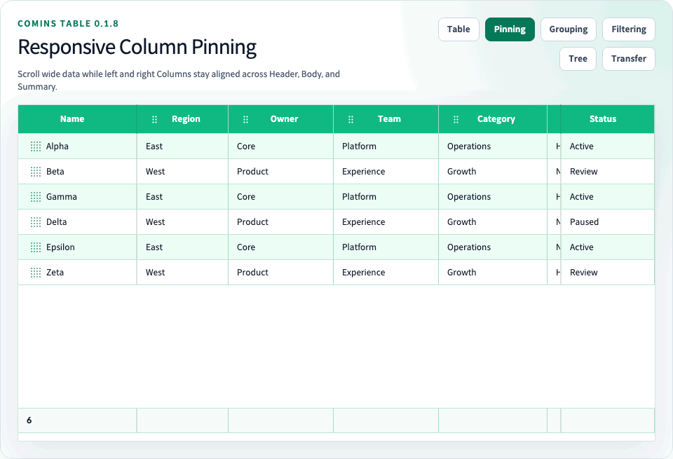

# Column Pinning

[문서 홈](../README.md) · [한글 가이드](README.md) · [English](../user/22-column-pinning.md) · [Playground](http://127.0.0.1:4002/examples/column-pinning)



Column Pinning은 Body, Header와 Summary가 수평 Scroll될 때 configured Column을 계속 표시합니다. Column 또는 2단계 Header Group에 `pinned: "left"` 또는 `pinned: "right"`를 지정합니다.
Export된 `CominsColumnPinned` type은 Column 정의, Group 정의와 저장된 runtime layout state에서 사용하는 `"left" | "right"` union입니다.

<!-- comins-doc-example: fragment -->
```tsx
const columns = [
  { field: "name", label: "Name", pinned: "left", width: 180 },
  { field: "amount", label: "Amount", width: 140 },
  { field: "status", label: "Status", pinned: "right", width: 140 },
] satisfies Array<CominsTableColumn<Row>>;

const columnGroups = [
  { children: ["name"], id: "identity", label: "Identity", pinned: "left" },
];

<CominsTable columns={columns} columnGroups={columnGroups} data={rows} />;
```

## 위치와 layout

- Configured pinned Column과 Group은 이동할 수 없습니다. 기존 `lockPosition`은 별도의 위치 잠금 조건으로 유지됩니다.
- 유효한 Header Group은 모든 visible child를 하나의 atomic block으로 소유합니다. Group `pinned`가 child 값보다 우선하며, unpinned Group 안의 child pin 값은 무시됩니다.
- Column resize는 계속 허용되며 반영된 너비로 sticky offset을 즉시 다시 계산합니다. Effective pinned Column 또는 Header Group을 직접 Resize할 때는 다른 effective pinned block과 center content 48px를 유지하는 최대 너비로 제한하므로, Resize 중인 surface가 scrolling content 아래로 demote되지 않습니다.
- `getColumnLayout()`, `setColumnLayout()`, `serializeCominsColumnLayout()`, `applyCominsColumnLayout()`은 visibility, order, width와 함께 `pinned`를 저장하고 복원합니다.
- `pinned`가 없는 legacy layout 또는 잘못된 runtime pin 값은 예외 없이 해당 entity를 center zone으로 복원합니다.

## Responsive demotion

Configured visual order는 left, center, right이며 각 zone 안의 상대 순서는 유지됩니다. Container가 48 CSS pixel 이상이면 center content를 최소 48px 확보합니다. Pinned width가 이 범위를 침범하면 더 넓은 side의 안쪽 atomic block부터 demote하며, 양쪽 너비가 같으면 right를 먼저 demote합니다. Container가 48px보다 좁으면 모든 block을 임시 demote합니다.

Demotion은 현재 렌더링에만 적용됩니다. Configured `pinned` 값을 변경하거나 `onChangeColumnLayout`을 호출하지 않으며 `getColumnLayout()` 결과도 바꾸지 않습니다.

직접 Resize 제한과 responsive demotion은 서로 다른 event를 처리합니다. Effective pinned block의 Resize gesture는 해당 block의 pin을 유지합니다. 별도의 container Resize는 가용 budget을 다시 계산하므로 안쪽 block을 임시 demote할 수 있으며, 이미 demote된 block은 공간이 다시 확보될 때까지 center content로 동작합니다.

## 렌더링 경계

Header, Body, Skeleton과 Summary Cell은 같은 effective zone과 offset을 사용합니다. Summary `colSpan`이 zone 경계를 넘으면 내부 fragment로 렌더링하며 첫 fragment만 content와 public test ID를 유지합니다. Row parity, selection, disabled 상태, custom Row 배경과 Skeleton/Summary surface는 center content 위에서 불투명하게 유지됩니다.

수평 overflow는 전체 Table 최하단의 native scrollbar 하나를 사용합니다. Summary는 scrollbar 위에 유지되며 Body의 horizontal wheel 입력 또는 scrollbar 직접 입력이 pin offset을 변경하지 않고 모든 rendering surface를 동기화합니다.

Synthetic Group Row, Row Detail, empty/loading Row와 다른 full-width structural Row는 하나의 spanning Cell을 유지합니다. Group Row Cell은 full-width를 유지하지만 내부 title과 control은 가로 스크롤 중 Body viewport 시작점에 sticky로 남습니다. Tree Grid에는 Column Pinning을 적용하지 않습니다.

Playground의 [`/examples/column-pinning`](http://127.0.0.1:4002/examples/column-pinning) route에서 확인할 수 있습니다.
