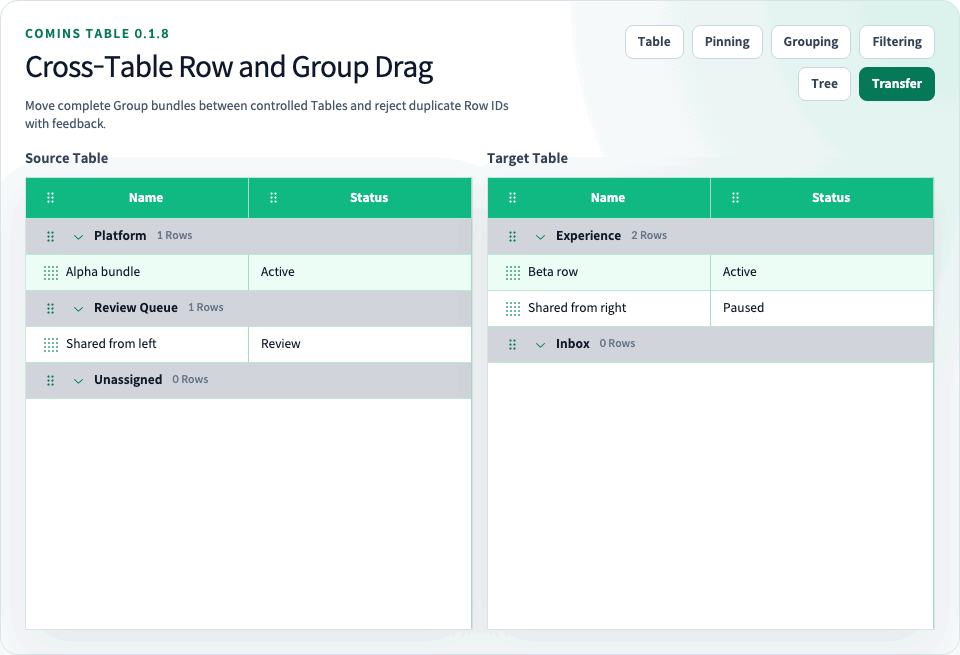

# Table 간 Row 및 Group Drag

<!-- comins-restriction: transfer-duplicate-default-reject -->

[문서 홈](../README.md) · [한글 가이드](README.md) · [English](../user/23-cross-table-drag.md) · [Playground](http://127.0.0.1:4002/examples/cross-table-drag)



Cross-Table Drag는 기존 Row 및 Group Drag handle을 다른 Comins Table까지 확장합니다. Application이 Coordinator를 만들고 참여할 모든 Table에 같은 객체, `scope`, 고유한 `tableId`를 전달합니다.

<!-- comins-doc-example: fragment -->
```tsx
const coordinator = createCominsTableTransferCoordinator<Row, Group>({
  onTransfer: ({ source, target }) => {
    updateTable(source.tableId, source.data, source.groups);
    updateTable(target.tableId, target.data, target.groups);
  },
  onTransferRejected: ({ conflict, reason }) => {
    logTransferRejection({ conflict, reason });
  },
});

const tableTransfer = (tableId: string) => ({
  coordinator,
  scope: "people",
  tableId,
  resolveConflict: () => "reject" as const,
  rejectionFeedback: {
    duration: 2400,
    renderTooltip: (rejection) => (
      <>
        <strong>Duplicate ID</strong>
        <span>{`"${String(
          rejection.conflict.kind === "group"
            ? rejection.conflict.groupId
            : rejection.conflict.rowId,
        )}" ID가 이미 존재합니다.`}</span>
      </>
    ),
  },
});

<CominsTable tableTransfer={tableTransfer("left")} rowProps={{ draggable: true }} />;
<CominsTable tableTransfer={tableTransfer("right")} rowProps={{ draggable: true }} />;
```

Coordinator는 application data를 소유하거나 optimistic Table state를 만들지 않습니다. Source와 target의 next model을 포함한 immutable result를 한 번 전달합니다. `result.source`와 `result.target`을 같은 application transaction에서 반영해야 합니다. 한쪽만 반영한 partial controlled update는 library가 대신 복구하지 않습니다.

## Transfer 규칙

- 같은 Coordinator 객체와 `scope`, 고유 `tableId`, 같은 `TData`/`TGroup` 계약을 가진 Table끼리만 이동할 수 있습니다.
- Flat Row는 flat Table로만 이동합니다. Grouped Row는 grouped Table로만 이동하며 membership이 바뀌면 target `setRowGroupId`가 필요합니다.
- Row Drag는 Row 하나를 옮깁니다. Target Row 앞, flat Body 끝 또는 collapsed/empty Group을 포함한 target Group Row에 Drop할 수 있습니다.
- 마지막 member Row를 이동해도 application-owned source Group은 빈 Group으로 유지됩니다.
- Group Drag는 Group 하나와 모든 member Row를 함께 옮깁니다. 성공하면 source Group을 제거하며 빈 Group도 이동할 수 있습니다.
- Group 위치는 실제 target `groups` 배열 순서입니다. Group Row는 자동 정렬하지 않습니다.
- Business Row 및 Group ID는 전이 전후에 유지되어야 합니다.

Selection, Cell/range 상태, Row Detail expansion과 Group disclosure 상태는 자동으로 이동하지 않습니다. Controlled render 성공 후 가능한 경우 destination Row 또는 Group control에 focus를 복구하고, 없으면 destination Table root로 fallback합니다.

## 권한과 충돌

Target Table이 `canTransfer`와 `resolveConflict`를 소유합니다. `canTransfer(intent)`는 model 전이 전에 거부할 수 있습니다. 중복 Row 또는 Group ID는 기본 reject이며 resolver가 undefined 또는 지원하지 않는 값을 반환해도 reject합니다.

Pointer Drop의 duplicate conflict가 `"reject"`로 확정되면 target Table에 절제된 error outline을 표시하고 pointer release 좌표 옆에 compact한 `Duplicate ID` Tooltip을 표시합니다. Feedback은 `pointerup` 이후에만 생성되고 `pointer-events: none`이며 semantic Table Body 외부에 위치합니다. Browser viewport 안으로 위치를 보정하고 polite live status로 알리므로 hit-test 대상 Drop 영역을 대체하거나 이후 interaction을 차단하지 않습니다.

`tableTransfer.rejectionFeedback`은 target Table 설정입니다. `renderTooltip(rejection)`으로 Tooltip body를 교체하고 `duration`으로 500~10000ms 범위의 표시 시간을 지정할 수 있으며 기본값은 1800ms입니다. `rejectionFeedback: false`이면 기본 Tooltip과 outline을 표시하지 않습니다. Built-in feedback을 꺼도 `Coordinator.onTransferRejected(rejection)`은 `reason: "duplicate-id"`, source/target Table ID, transfer kind와 실제 reject된 conflict를 전달합니다. `canTransfer()` 거부는 application-owned 정책이므로 duplicate conflict notification을 발생시키지 않습니다.

Tooltip의 positioning과 accessibility 동작을 유지하면서 다음 CSS 변수로 디자인을 변경할 수 있습니다.

```css
.comins-table {
  --comins-table-tooltip-danger-background: #7f1d1d;
  --comins-table-tooltip-danger-border: rgba(254, 202, 202, 0.28);
  --comins-table-tooltip-danger-color: #ffffff;
  --comins-table-tooltip-danger-muted: #fecaca;
  --comins-table-tooltip-shadow: 0 12px 30px rgba(69, 10, 10, 0.28);
}
```

파괴적 교체가 의도된 경우에만 `"overwrite"`를 반환해야 합니다. Row overwrite는 같은 ID의 target Row를 제거한 뒤 삽입합니다. Group overwrite는 target Group과 모든 member Row를 제거한 다음 source Group bundle을 삽입하며 두 Group을 merge하지 않습니다. 확정된 conflict는 감사 또는 알림을 위해 `result.details`에 포함됩니다.

Pure `transferCominsRowBetweenTables()`와 `transferCominsGroupBetweenTables()` helper로 UI와 같은 immutable reject/overwrite model 전이를 application JavaScript에서 사용할 수 있습니다. Pure helper에는 Coordinator와 pointer lifecycle이 없으므로 reject 시 `null`을 반환하며 Tooltip feedback이나 `onTransferRejected`를 발생시키지 않습니다.

## Lifecycle과 지원 조합

하나의 Coordinator scope에서 `tableId`가 중복 등록되면 fail closed합니다. Stale/unmounted source 또는 target, 사라진 target identity, 변경된 business ID, 호환되지 않는 flat/grouped shape 또는 callback 거부는 `onTransfer`를 호출하지 않습니다.

Pointer가 다른 valid target Body의 위·아래 edge 안에 있으면 해당 target만 세로 auto-scroll하고 매 frame Drop target을 다시 확인합니다. 기존 same-Table Drag 동작은 변경하지 않습니다. `pointercancel`, `Escape`, window blur와 unmount는 listener, marker와 pending animation frame을 정리합니다.

Tree Grid, Column Filtering, Infinite Scroll 및 Lazy Load와 Cross-Table Transfer를 결합할 수 없습니다. Tree transfer는 별도 기능으로 유지합니다.

Playground의 [`/examples/cross-table-drag`](http://127.0.0.1:4002/examples/cross-table-drag) route에서 확인할 수 있습니다.
