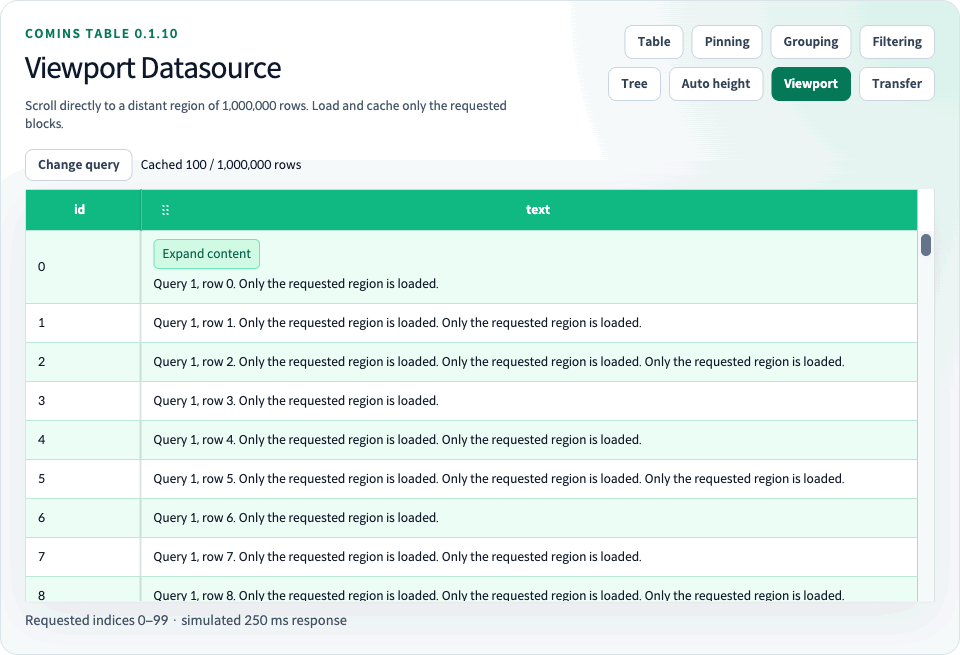

# Viewport Datasource



[한글 가이드](README.md) · [English](../user/25-viewport-datasource.md) · [Playground](http://127.0.0.1:4002/performance/viewport-datasource)

앞선 페이지를 모두 다운로드하거나 전체 건수만큼 배열을 만들지 않고 현재 스크롤 주변 구간을 조회합니다. 애플리케이션은 전체 건수를 알고 안정적인 임의 인덱스 구간 조회를 지원해야 합니다. 네트워크·인증·정렬·필터·저장은 앱이 소유하며 Table이 필요한 구간을 결정합니다.

`useCominsViewport<TData>`에 `rowCount`, 문자열 또는 숫자 `queryKey`, `getRows`를 연결합니다. hook은 소비자 컴포넌트의 React 상태를 관리하고 controlled `data`, `viewportDatasource`, `onViewportRequest`, `onChangeData`를 포함한 `tableProps`를 반환합니다. 의미가 같으면 Column과 조회 설정의 참조를 안정적으로 유지합니다.

hook이 조회 결과와 편집을 Table에 연결하므로 일반적인 사용에서는 snapshot과 reducer를 직접 관리할 필요가 없습니다. 여기서 snapshot은 전체 건수·로딩된 block·요청 상태를 담은 하나의 객체이며 reducer helper는 이벤트에 따라 다음 객체를 반환하는 함수입니다. `tableProps`에는 `virtualized: true`가 자동으로 포함됩니다.

<!-- comins-doc-example: fragment -->
```tsx
const viewport = useCominsViewport<Person>({
  rowCount,
  queryKey: searchRevision,
  getRows: async ({ startIndex, endIndex, signal }) => {
    const response = await fetch(
      `/api/people?offset=${startIndex}&limit=${endIndex - startIndex}`,
      { signal },
    );
    if (!response.ok) throw new Error("Unable to load rows");
    return response.json();
  },
});

<CominsTable
  {...viewport.tableProps}
  columns={columns}
  getRowId={(row) => row.id}
  getRowHeight={() => "auto"}
  estimatedRowHeight={56}
/>
```

## 요청과 캐시

구간은 `[startIndex, endIndex)`입니다. 마지막 짧은 block을 포함하여 정확히 요청한 수의 업무 Row 배열을 반환합니다. API가 `{ rows, total }` 형태라면 callback에서 `rows`를 추출하고 확인된 전체 건수를 `rowCount`로 전달합니다. 누락·null Row 또는 불완전 응답은 오류입니다. `AbortSignal`로 오래된 요청을 취소하고 이전 dataset revision·request token 응답은 무시합니다. 실패 구간에는 명시적인 재시도 조작을 제공합니다. 자동 무한 재시도나 내장 HTTP/WebSocket 클라이언트는 없습니다.

기본값은 `blockSize: 100`, `cacheSize: 12`, `maxConcurrentRequests: 2`, `heightCacheSize: 64` block입니다. 유효한 양의 정수가 아닌 옵션은 기본값으로 대체합니다. 현재 화면과 활성 요청을 보존하기 위해 작은 설정 한도보다 실효 캐시가 커질 수 있습니다. 높이는 별도 희소 캐시를 사용하며 퇴출된 높이는 재방문 시 추정값으로 돌아갑니다. 관련 Row 측정 전 전체 scroll 높이와 thumb 크기는 추정치입니다. 전체 dataset 길이의 배열은 생성하지 않습니다.

검색·정렬·datasource·인덱스 순서가 변경되면 `queryKey`를 바꿉니다. 건수 변경도 dataset을 초기화합니다. 초기화는 요청을 취소하고 데이터·높이·선택·스크롤 위치를 정리합니다. 같은 revision 안에서는 건수와 순서를 유지합니다. 건수를 모르면 먼저 count를 조회한 뒤 Viewport를 활성화합니다.

## 선택과 편집

`getRowId`는 필수이며 전역적으로 안정적이고 고유해야 합니다. callback의 `row.dataIndex`, `row.index`, Row/Cell 이벤트 `index`는 전체 dataset의 절대 위치입니다. Skeleton은 업무 ID·Renderer·formatter·선택·편집 callback을 호출하지 않습니다. Row 선택은 ID로 캐시 퇴출을 견디며 `setSelectedRow(s)`는 절대 인덱스를 받고 미수신 Row는 건너뜁니다. Cell range는 연속으로 로딩된 구간만 허용합니다. Clipboard가 미수신 구간을 자동 다운로드하거나 구멍을 넘어 일부만 붙여넣지 않습니다. Row 삽입·이동은 지원하지 않습니다.

로딩된 Cell 편집·붙여넣기는 controlled snapshot을 갱신합니다. hook의 선택적 `onEdit(changes)`는 절대 인덱스 patch를 전달합니다. 서버 저장과 fetch cache 밖의 미저장값 보존은 앱의 책임입니다. `getRows` 응답에 미저장 변경을 다시 합치거나 서버 저장을 확정해야 합니다. 유지 중인 block에서는 이전 조회 응답이 이후 편집을 덮지 못합니다. 퇴출 후 새로 조회한 block은 앱이 편집을 보존하지 않으면 서버 값으로 돌아올 수 있습니다. `onChangeData`는 저장 완료 통지가 아닙니다.

## 지원 조합

서버 정렬·필터는 외부 쿼리 UI로 조작합니다. 내장 Header 정렬, sort Ref, Column Filtering, 자동 Summary 집계는 비활성화합니다. 고정·자동 높이, Cell Renderer, pinning, Column resize, 로딩된 Row 편집을 지원합니다. Tree·Row Grouping·Row Detail·Row drag·append loading·pagination과 결합하지 않습니다. Export helper는 계속 앱이 명시적으로 전달한 Row만 처리합니다. 실시간 서버 push는 이 모드의 범위 밖입니다.

## 직접 상태 연동

고급 controlled 연동에는 `CominsViewportTableProps<TData>`, `CominsViewportData<TData>`, `createCominsViewportData`, `reduceCominsViewportData`를 직접 사용할 수 있습니다. snapshot은 revision·건수·block·제한된 요청 상태를 포함하고 block은 절대 시작 인덱스와 Row를 보관합니다. reducer 이벤트는 `request`, `success`, `error`, `cancel`, `retain`, `patch`, `reset`입니다. 데이터와 요청 완료를 함께 반영하며 Promise 완료만으로 controlled success/error 갱신을 대신하지 않습니다. 함수형 상태 갱신으로 독립적인 block 응답을 보존합니다. hook과 callback 계약 타입은 `CominsViewportOptions`, `CominsViewportDatasource`, `CominsViewportRequest`, `CominsViewportPatch`입니다.

## Playground 확인

자동 높이·느린 응답·오류 응답을 토글로 전환합니다. 오류 응답을 켠 뒤 검색 결과를 변경하면 재시도 컨트롤이 나타나며, 오류 응답을 끄고 재시도하면 로딩을 복구합니다. Viewport에서는 Row Drag를 사용할 수 없고 핸들도 표시하지 않습니다. 서버에서 순서를 변경했다면 새 `queryKey`로 다시 조회합니다.
