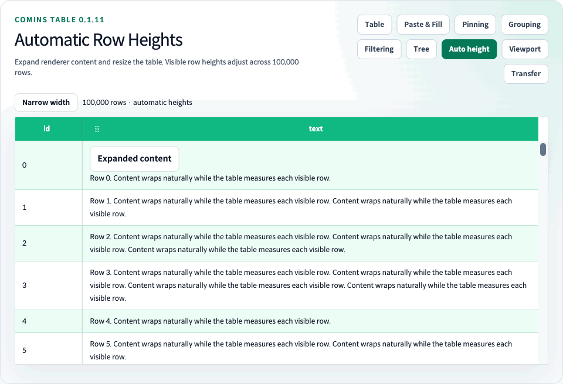

# Automatic Row Height



[English guides](README.md) · [한국어](../ko/24-auto-row-height.md) · [Playground](http://127.0.0.1:4002/performance/auto-row-height)

`rowHeight` remains the numeric default (36). Set `getRowHeight` once to measure every business Row automatically, or return a positive finite number for selected Rows. An omitted callback or `undefined` result uses `rowHeight`. Invalid numeric values fall back to the default. `CominsRowHeight` and `CominsRowHeightParams<TData>` describe this API.

| Option | Behavior |
| --- | --- |
| `rowHeight={36}` | Default numeric height when no per-Row policy is supplied |
| `getRowHeight={({ row }) => ...}` | Return a positive number, `"auto"`, or `undefined`; `row.data` is the business data |
| `estimatedRowHeight` | Initial automatic-height estimate; defaults to the resolved `rowHeight` |
| `virtualized` | Enables windowed rendering; automatic measurement also works without it |

<!-- comins-doc-example: fragment -->
```tsx
<CominsTable
  columns={columns}
  data={rows}
  getRowId={(row) => row.id}
  getRowHeight={() => "auto"}
  estimatedRowHeight={56}
  virtualized
/>
```

`estimatedRowHeight` is a temporary estimate, not a limit or a required Renderer height. It defaults to `rowHeight`. Renderers do not need to calculate heights or attach observers. Automatic Rows use the tallest displayed Cell's normal-flow content, including padding and borders. Dynamic content, images, fonts and column width changes trigger measurement. Default text truncation is preserved; use a wrapping Renderer or Cell style when text should wrap.

Portals, absolutely positioned overlays and transform-only visual enlargement do not contribute to natural Row height. For an internally scrolling Renderer, the outer container contributes its height. Do not use Row/Cell CSS height as a separate virtual-layout API; `getRowHeight` owns the height policy when supplied.

For fixed-height Rows, keep custom Renderer content within the chosen height, for example with a single line and ellipsis. A wrapping Renderer can expand a native table cell beyond its numeric CSS height while the fixed virtual layout still uses `rowHeight`. Use automatic height when the Row should grow with that content. The Viewport Playground switches between single-line fixed content and wrapping automatic content.

Automatic and numeric heights work with or without virtualization. CSR Flat, Grouped business Rows and Tree Rows are supported. Group headings, Header and Summary keep their existing height policies. A Flat Row and its expanded Detail are measured independently and combined for virtual placement. Existing supported pinning, filtering, clipboard and drag combinations remain available.

Only mounted automatic Rows and Details are observed. Fixed-height Rows keep the arithmetic virtual path when all effective heights use the common `rowHeight`. Variable heights use a height index and preserve the visible Row and its internal offset when measurements change. Deleted or shrinking anchors are clamped; exact unknown heights and an unchanging scrollbar thumb are not guaranteed.

[Viewport loading](25-viewport-datasource.md) also supports automatic heights. Its unloaded rows use the estimate, and both data and height history have bounded caches.
